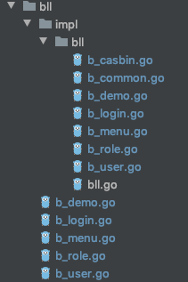

<h1 align="center">zmang</h1>

- 基于gin-admin([点击访问](https://github.com/LyricTian/gin-admin)),去掉了按钮动作对象,将按钮和菜单统一为菜单对象,作为权限粒度
- 替换前端项目为基于iview-admin的zview([点击访问](https://github.com/zzpu/zview))

## 架构及代码目录结构介绍
- 采用经典三层架构,表示层(UI)、业务逻辑层(BLL)和数据访问层(DAL).
- 各层交互通过预先约定的接口,在各层文件加impl,包含各个接口的实现



- 

## 依赖工具

```
go get -u github.com/cosmtrek/air
go get -u github.com/google/wire/cmd/wire
go get -u github.com/swaggo/swag/cmd/swag
```

- [air](https://github.com/cosmtrek/air) -- Live reload for Go apps
- [wire](https://github.com/google/wire) -- Compile-time Dependency Injection for Go
- [swag](https://github.com/swaggo/swag) -- Automatically generate RESTful API documentation with Swagger 2.0 for Go.

## 依赖框架

- [Gin](https://gin-gonic.com/) -- The fastest full-featured web framework for Go.
- [GORM](http://gorm.io/) -- The fantastic ORM library for Golang
- [Mongo](https://github.com/mongodb/mongo-go-driver) -- The Go driver for MongoDB
- [Casbin](https://casbin.org/) -- An authorization library that supports access control models like ACL, RBAC, ABAC in Golang
- [Wire](https://github.com/google/wire) -- Compile-time Dependency Injection for Go

## 快速开始（或者使用[gin-admin-cli](https://github.com/gin-admin/gin-admin-cli)）

> 也可以使用国内源：https://gitee.com/lyric/gin-admin

```bash
$ go get -u -v github.com/LyricTian/gin-admin/v6/cmd/gin-admin
$ cd $GOPATH/src/github.com/LyricTian/gin-admin
# 使用AIR工具运行
$ air
# OR 基于Makefile运行
$ make start
# OR 使用go命令运行
$ go run cmd/gin-admin/main.go web -c ./configs/config.toml -m ./configs/model.conf --menu ./configs/menu.yaml
```

> 启动成功之后，可在浏览器中输入地址进行访问：[http://127.0.0.1:10088/swagger/index.html](http://127.0.0.1:10088/swagger/index.html)

## 生成`swagger`文档

```
# 基于Makefile
make swagger
# OR 使用swag命令
swag init --generalInfo ./internal/app/swagger.go --output ./internal/app/swagger
```

## 重新生成依赖注入文件

```
# 基于Makefile
make wire
# OR 使用wire命令
wire gen ./internal/app/injector
```

## 前端工程

- 基于[Ant Design React](https://ant.design/index-cn)版本的实现：[gin-admin-react](https://github.com/gin-admin/gin-admin-react)(也可使用国内源：[https://gitee.com/lyric/gin-admin-react](https://gitee.com/lyric/gin-admin-react))

## 互动交流

### 与作者对话

> 该项目是利用业余时间进行开发的，开发思路主要是源于自己的项目积累及个人思考，如果您有更好的想法和建议请与我进行沟通，一起探讨，畅聊技术人生，相互学习，一起进步。我非常期待！下面是我的微信二维码（如果此项目对您提供了帮助也可以请作者喝杯咖啡 (\*￣︶￣)，聊表心意，一起星巴克「续杯」~嘿嘿 ）：

<div>


</div>

### QQ 群：1409099


## 付费支持

> **该框架本身的结构逻辑和实现细节点还是蛮多的，作者认为能够熟练应用此框架并快速产出作品还是需要一个摸索的阶段的。因而，作者原意贡献个人休闲娱乐时间，为大家提供服务！帮助大家快速掌握此框架，并如何使用 gin-admin-cli 快速产出功能模块，以 1\*10 的效率完成业务模块的开发。当然，在开发业务期间，遇到任何技术上的难题，作者将全心全力协助解决！再次感谢您的支持！作者会不断优化和改进此框架，更好的服务于大家！**

## MIT License

    Copyright (c) 2020 Lyric

[reportcard-url]: https://goreportcard.com/report/github.com/LyricTian/gin-admin
[reportcard-image]: https://goreportcard.com/badge/github.com/LyricTian/gin-admin
[godoc-url]: https://godoc.org/github.com/LyricTian/gin-admin
[godoc-image]: https://godoc.org/github.com/LyricTian/gin-admin?status.svg
[license-url]: http://opensource.org/licenses/MIT
[license-image]: https://img.shields.io/npm/l/express.svg
